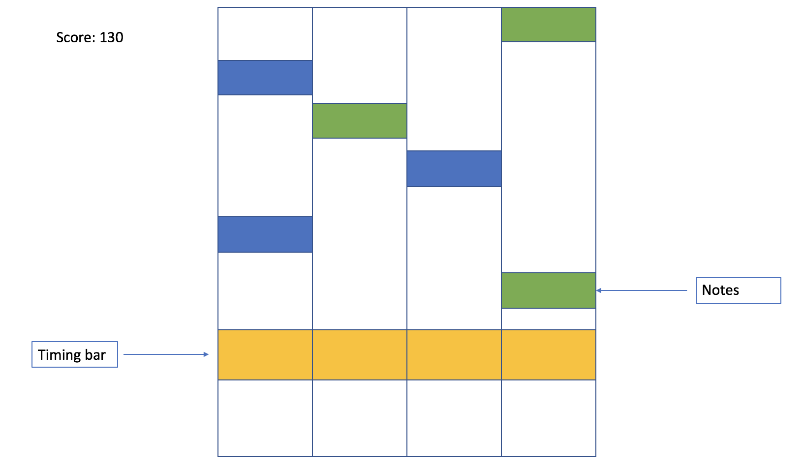

# Go2Jam

[Live Link](http://go2jam.brendanko.com/)

Go2Jam is a JavaScript/HTML5 Canvas rhythm game based on the Korean rhythm game O2Jam. The game consists of a music board with beats scrolling downwards where players press keys in time with the beat.

## Features

### Timing Bar
The game consists of a board with four columns, each having beats scroll downwards. Near the bottom is a bar where players should press the respective key in time with the beat to hit the beat.

### Score system
When players time the beats to the timing bar, there is a score to keep track of the player's progress. If players time the key while the beat is mostly in the timing bar, they get points and increase their combo multiplier. Otherwise, the beat won't count towards their score and their combo multiplier resets.

### Difficulties
Since everyone has a different skill level, the game incorporates different difficulties for songs to make it more approachable or challenging depending on the individual.

### Menu
In order to choose the difficulty, a menu has been implemented to allow players to choose the song and difficulty they wish to play. The song will load with the `BeatMap` of the respective difficulty chosen.

### Multiple songs

If there is additional time available, I would like to incorporate multiple songs with new beatmaps that would increase the diversity of the game.

## Technologies Used

- JavaScript
  - JavaScript takes care of the game logic, such as giving telling the canvases when to render beats and how each beat is timed in the timing bar.
- HTML
  - I mainly use HTML canvas and audio elements for Go2Jam. Multiple canvases are rendered and keep track of each beat column, with audio elements that are played when prompted.
- CSS
  - In order to organize all the elements and add features such as modals, any non-canvas elements, as well as the canvases themselves are adjusted through CSS.

## Wireframes

